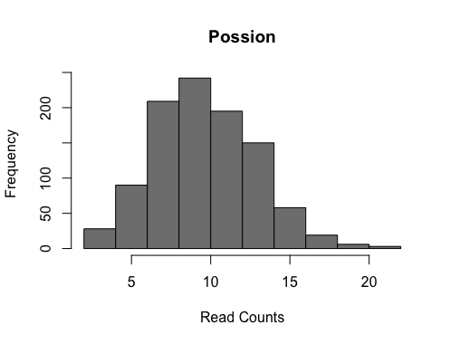
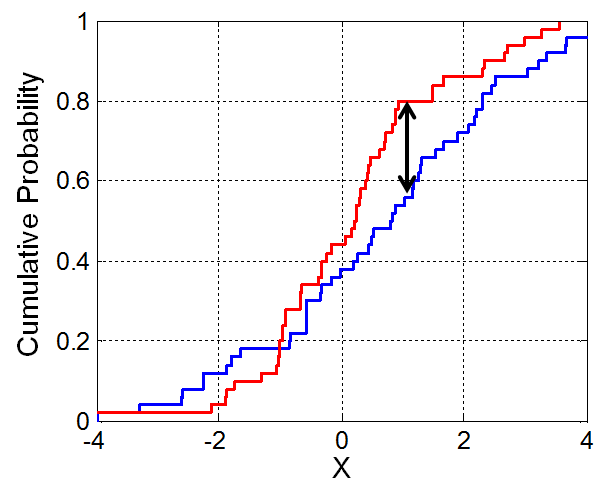

# 3. Differential Expression Analysis
-- Yang Eric Li

One of the most common types of analyses when working with bulk RNA-seq data is to identify differentially expressed genes. By comparing the genes that change between two conditions, e.g. mutant and wild-type or stimulated and unstimulated, it is possible to characterize the molecular mechanisms underlying the change. Several different methods, e.g. DESeq2 and edgeR, have been developed for bulk RNA-seq.

## 3.1 Normalization

### 3.1.1 widly used quantifies
* raw counts

* RPKM: Reads Per Kilobase of exon model per Million mapped reads \(每千个碱基的转录每百万映射读取的reads\)

* FPKM: Fragments Per Kilobase of exon model per Million mapped fragments\(每千个碱基的转录每百万映射读取的fragments, 对于Pair-end sequencing, two paired reads should be mapped simultaneously\)

```
RPKM = total exon reads/ (mapped reads (Millions) * exon length(KB))
```

* TPM：Transcripts Per Kilobase of exon model per Million mapped reads \(每千个碱基的转录每百万映射读取的Transcripts\)

```
TPMi=(Ni/Li)*1000000/sum(Ni/Li+……..+ Nm/Lm)
```

* RPM/CPM: Reads/Counts of exon model per Million mapped reads \(每百万映射读取的reads\)

```
RPM=total exon reads / mapped reads (Millions)
```

### 3.1.2 Relative vs absolute expression
As shown above, we have been estimating the relative abundance, i.e. what proportion of transcripts in a sample belong to a particular isoform. Can we estimate the absolute abundance from RNA-Seq data?

Consider the two cells drawn below. The colored squiggly lines represent individual transcripts of the corresponding isoforms.


Cell B has twice as many transcripts of each isoform as cell A. If we conduct RNA-Seq experiments in the two cells, we would get samples from essentially the same distribution. We wouldn’t be able to tell the cells apart based on their RNA-Seq.

Here’s a trick: during library preparation, we add a known amount of an artificial RNA or DNA that is not produced by the studied organism (the blue squiggle below), then we can compare all abundances against it. This artificially introduced material is called a spike-in.


If we regard the spike-in as isoform 0, with the known absolute abundance of T0 transcripts, then the absolute abundance of isoform i can be estimated as:

Ti = T0 * (RPMi / RPM0)

Whether we care about absolute or relative expression depends on the biological question in hand. However, looking at relative expression alone can produce unexpected results.

Suppose again that only two isoforms are being expressed, red and yellow. In condition A, the two isoforms are equally expressed. In condition B, the yellow isoform’s expression doubles, while the red isoform’s expression is not affected at all.


Now let’s look at the relative expression:


Based on this chart, we might conclude that the red isoform is also differentially expressed between the two conditions. Technically this is true, as long as we are talking about relative expression, but this is only a consequence of the overexpression of the yellow isoform.

**Notes**

[RNA-Seq normalization explained](https://ro-che.info/articles/2016-11-28-rna-seq-normalization)

### 3.1.3 Systematic biases**


### 3.1.4 Size factor & global-scale normalization**


**Notes**
* Selecting Between-Sample RNA-Seq Normalization Methods from the Perspective of their Assumptions
[link](https://arxiv.org/pdf/1609.00959v1.pdf)
* Marie-Agnès Dillies, et al. A comprehensive evaluation of normalization methods for Illumina high-throughput RNA sequencing data analysis. Briefings in Bioinformatics, Volume 14, Issue 6, 1 November 2013, Pages 671–683 [link](https://academic.oup.com/bib/article/14/6/671/189645)
* Catalina A Vallejos, et al. Normalizing single-cell RNA sequencing data: challenges and opportunities. Nature Methods volume 14, pages 565–571 [link](https://www.nature.com/articles/nmeth.4292)


## 3.2 Models of RNA-seq data
### 3.2.1 negative binomial model
The most common model of RNASeq data is the negative binomial model:
```
set.seed(1)
hist(
    rnbinom(
        1000,
        mu = 10,
        size = 100),
    col = "grey50",
    xlab = "Read Counts",
    main = "Negative Binomial"
)
```


Mean:  **μ = mu**

Variance:  **σ2 = mu + mu2/size**

It is parameterized by the mean expression (mu) and the dispersion (size), which is inversely related to the variance.

### 3.2.2 possion models
In possion distribution, which presumes the variance and mean \[ ie. expression in our case\] are equal.
```
hist(
    rpois(1000, 10),
    col = "grey50",
    xlab = "Read Counts",
    main = "Possion"
)
```


Mean:  **μ = mu**

Variance:  **σ2 = mu **


### 3.2.3 zero-inflated negative binomial models
A raw negative binomial model does not fit full-length transcript data as well due to the high dropout rates relative to the non-zero read counts.
```
d <- 0.5;
counts <- rnbinom(
    1000,
    mu = 10,
    size = 100
)
counts[runif(1000) < d] <- 0
hist(
    counts,
    col = "grey50",
    xlab = "Read Counts",
    main = "Zero-inflated NB"
)
```


## 3.3 Commonly used test and tools

### 3.3.1 DESeq2

The package DESeq2 provides methods to test for differential expression by use of negative binomial generalized linear models
**Usage**

```
> dds <- DESeqDataSetFromMatrix(countData = cts,
colData = coldata,
design= ~ batch + condition)
> dds <- DESeq(dds)
> resultsNames(dds) # lists the coefficients
> res <- results(dds, name="condition_trt_vs_untrt")
# or to shrink log fold changes association with condition:
> res <- lfcShrink(dds, coef="condition_trt_vs_untrt")
```

**Tips**
[Analyzing RNA-seq data with DESeq2](http://bioconductor.org/packages/devel/bioc/vignettes/DESeq2/inst/doc/DESeq2.html)

**Notes**

> We shared scripts on github.
>
> * DESeq2 normalization: R package DESeq2.[Github.](https://github.com/SiqiWang94/R-packages/blob/master/DESeq2-package.R)

### 3.3.2 edgeR

**Usage**

```
> x <- read.delim("TableOfCounts.txt",row.names="Symbol")
> group <- factor(c(1,1,2,2))
> y <- DGEList(counts=x,group=group)
> y <- calcNormFactors(y)
> design <- model.matrix(~group)
> y <- estimateDisp(y,design)
To perform quasi-likelihood F-tests:
> fit <- glmQLFit(y,design)
> qlf <- glmQLFTest(fit,coef=2)
> topTags(qlf)
To perform likelihood ratio tests:
> fit <- glmFit(y,design)
> lrt <- glmLRT(fit,coef=2)
> topTags(lrt)
```

**Tips**
[edgeR Users Guide](https://www.bioconductor.org/packages/devel/bioc/vignettes/edgeR/inst/doc/edgeRUsersGuide.pdf)

**Notes**

> We shared scripts on github.
>
> * TMM normalization: R package edgeR.[Github.](https://github.com/SiqiWang94/R-packages/blob/master/edgeR-package.R)

### 3.3.3 Wilcox/Mann-Whitney-U Test

**Usage**
1. normalize the reads by library size \(edgeR\)
2. identify differential expressed gene using wilcoxon.test\(\)

> We shared scripts on github.
>
> * RPM normalization: R package edgeR to calculate RPM, then test by R function wilcoxon.test\(\).[Github.](https://github.com/SiqiWang94/R-packages/blob/master/RPM-Wilcoxon.R)

### 3.3.4 Kolmogorov-Smirnov test
The types of test that are easiest to work with are non-parametric ones. The most commonly used non-parametric test is the Kolmogorov-Smirnov test (KS-test) and we can use it to compare the distributions for each gene in the two individuals.

The KS-test quantifies the distance between the empirical cummulative distributions of the expression of each gene in each of the two populations. It is sensitive to changes in mean experession and changes in variability. However it assumes data is continuous and may perform poorly when data contains a large number of identical values (eg. zeros). Another issue with the KS-test is that it can be very sensitive for large sample sizes and thus it may end up as significant even though the magnitude of the difference is very small.



## 3.4 Optional: rank-based methods

X Li, et al. A rank-based algorithm of differential expression
analysis for small cell line data with statistical control. Briefings in Bioinformatics, 2017, 1–10 [link](https://academic.oup.com/bib/advance-article/doi/10.1093/bib/bbx135/4524052)


## 3.5 Homeworks

**Level I:**
1. learn how to calculate differential expression
2. draw venn plot to show the difference of differentail genes between different methods.

**Level II:**
1. Try to run rank-based method on our data.Try to implement the methods using R/Python.
