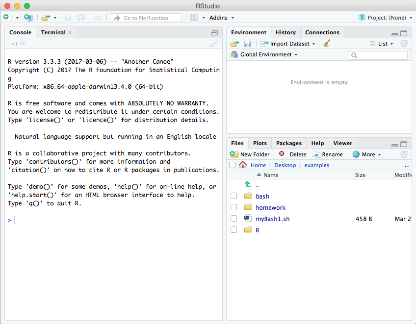
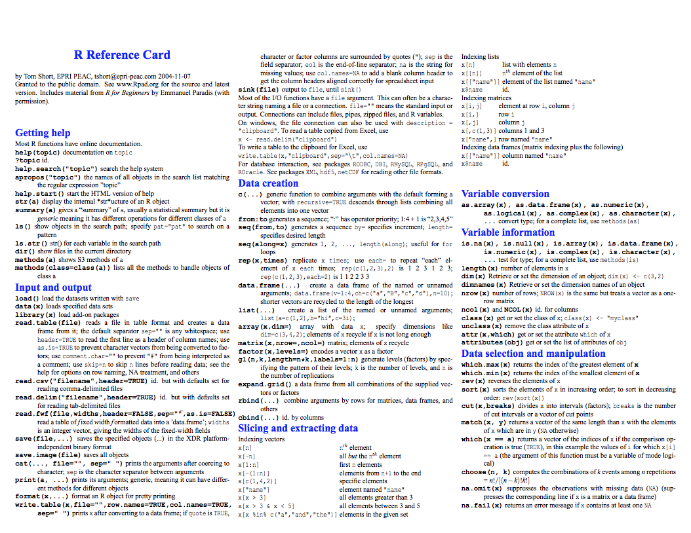
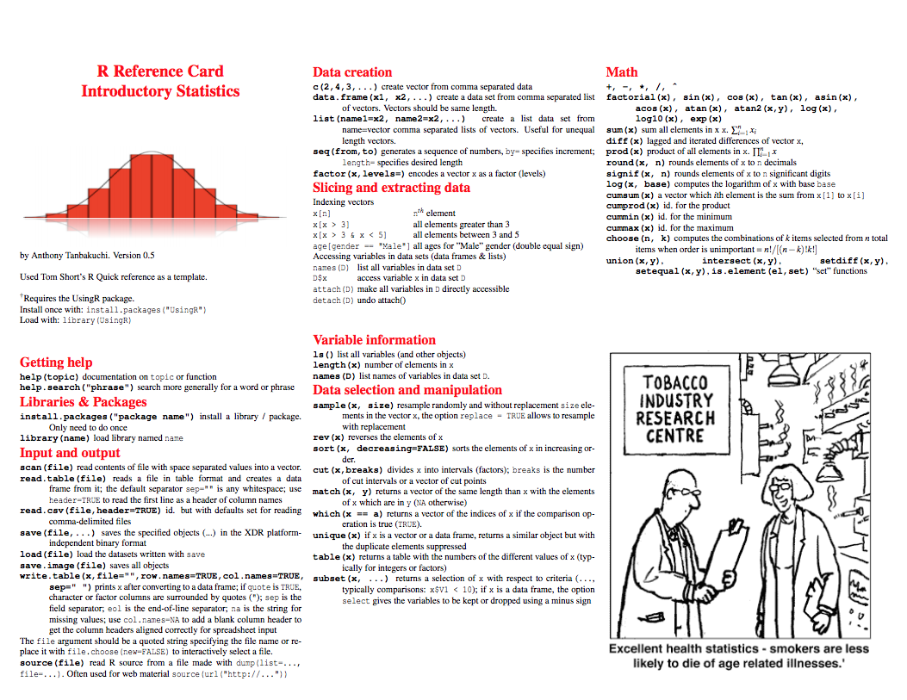
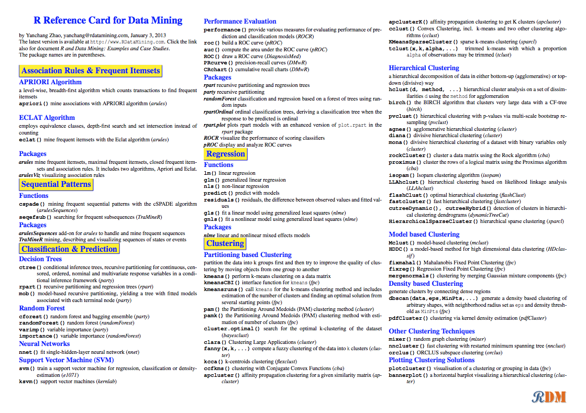
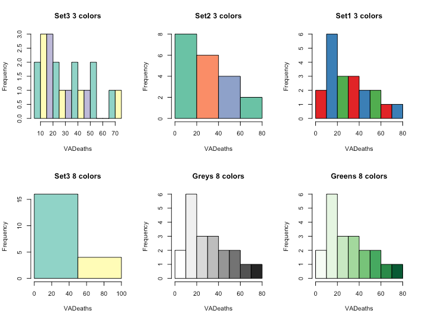
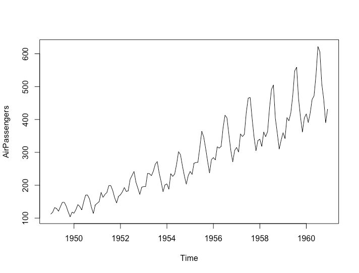
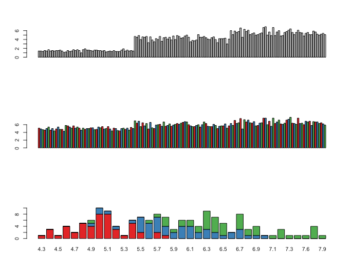
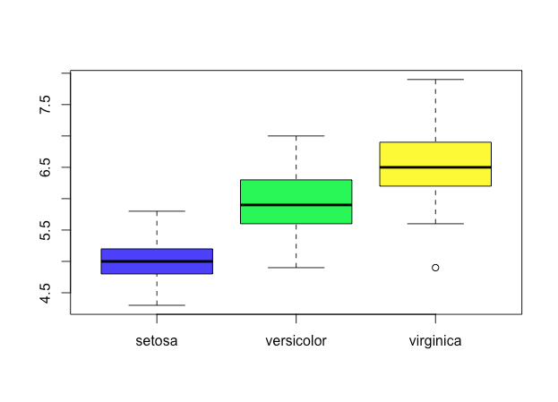
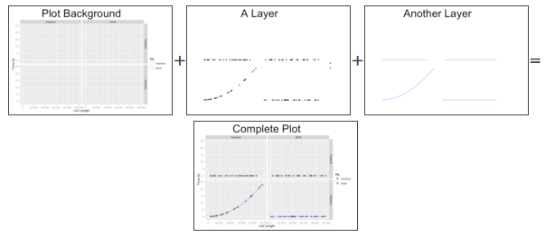
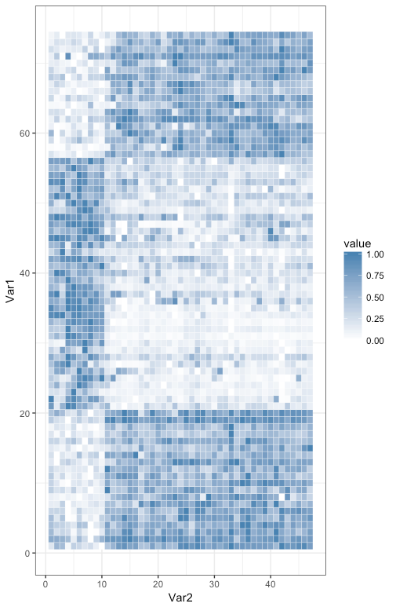

# 2.R\_basics

**R: How to make professional and beautiful plots**

## 1. lnstall R and Rstudio

**R: **[https://www.r-project.org/](https://www.r-project.org/)


**RStudio:** [https://www.rstudio.com/](https://www.rstudio.com/)


Open RStudio platform:



## 2. R basics

**R reference card:**

[https://cran.r-project.org/doc/contrib/Short-refcard.pdf](https://cran.r-project.org/doc/contrib/Short-refcard.pdf)

* **basic data types**

```text
> x = 10.5 # assign a decimal value
> x # print the value of x
[1] 10.5
> class(x) # print the class name of x
[1] "numeric"

> y = as.integer(3)
> y # print the value of y
[1] 3
> class(y) # print the class name of y
[1] "integer"

> z = 1 + 2i # create a complex number
> z # print the value of z
[1] 1+2i
> class(z) # print the class name of z
[1] "complex"

> x = 1; y = 2 # sample values
> z = x > y # is x larger than y?
> z # print the logical value
[1] FALSE
> class(z) # print the class name of z
[1] "logical"

> x = as.character(10.5)
> x # print the character string
[1] "10.5"
> class(x) # print the class name of x
[1] "character"
```

* **vector**

```text
> c(2, 3, 5)
[1] 2 3 5

> n = c(2, 3, 5)
> s = c("aa", "bb", "cc", "dd", "ee")
> c(n, s)
[1] "2" "3" "5" "aa" "bb" "cc" "dd" "ee"

> s = c("aa", "bb", "cc", "dd", "ee")
> s[3]
[1] "cc"
```

* **matrix**

```text
> B = matrix(
+ c(2, 4, 3, 1, 5, 7),
+ nrow=3,
+ ncol=2)

> B # B has 3 rows and 2 columns
[,1] [,2]
[1,] 2 1
[2,] 4 5
[3,] 3 7
```

* **list**

```text
> n = c(2, 3, 5)
> s = c("aa", "bb", "cc", "dd", "ee")
> b = c(TRUE, FALSE, TRUE, FALSE, FALSE)
> x = list(n, s, b, 3) # x contains copies of n, s, b
```

* **data frame**

```text
> n = c(2, 3, 5)
> s = c("aa", "bb", "cc")
> b = c(TRUE, FALSE, TRUE)
> df = data.frame(n, s, b) # df is a data frame
> df
n s b
1 2 aa TRUE
2 3 bb FALSE
3 5 cc TRUE
```

## 3. install.packages

```text
> install.packages("PACKAGE")

# using bioconductor.org
> source("https://bioconductor.org/biocLite.R")
> biocLite("PACKAGE")
```

**Common used packages**

* To load data:

> * **RMySQL:** read in data from a database or Excel.
> * **xlsx:** read in data from a Excel.

* To manipulate data:

> * **stringr:** easy to learn tools for regular expressions and character strings.
> * **reshape2:** transform data between wide and long formats.

* To visualize data:

> * **gplots:** heatmap.2
> * **ggplot2:** plotting system for R, based on the grammar of graphics
> * **plotly:** R package for creating interactive web-based graphs

* To model data:

> * **lme4, nlme:** Linear and Non-linear mixed effects models
> * **randomForest: **Random forest methods from machine learning
> * **glmnet:** Lasso and elastic-net regression methods with cross validation
> * **NMF:** do non-negative matrix factorization

* To do bioinformatics:

> * **limma, DESeq2, edgeR:** do differential expression \([https://www.nature.com/articles/nprot.2013.099\](https://www.nature.com/articles/nprot.2013.099%29\)
> * **survival:** Tools for survival analysis
> * **motifRG, MotIV, MotifDb:** motif search and enrichment
> * **enrichR:** GO term enrichment

* To write your own R packages:

> * devtools: An essential suite of tools for turning your code into an R package.

## 4. Statistics

**R reference card \(introductory statistics\):**

[http://www.u.arizona.edu/~kuchi/Courses/MAT167/Files/R-refcard.pdf](http://www.u.arizona.edu/~kuchi/Courses/MAT167/Files/R-refcard.pdf)

## 5. Data mining

**R reference card \(data mining\):**

[https://cran.r-project.org/doc/contrib/YanchangZhao-refcard-data-mining.pdf](https://cran.r-project.org/doc/contrib/YanchangZhao-refcard-data-mining.pdf)

## 6. Data visualizations

**Basic visualizations**

* Histogram

```text
> library(RColorBrewer)
> data(VADeaths)
> head(VADeaths[,1:4])
Rural Male Rural Female Urban Male Urban Female
50-54 11.7 8.7 15.4 8.4
55-59 18.1 11.7 24.3 13.6
60-64 26.9 20.3 37.0 19.3
65-69 41.0 30.9 54.6 35.1
70-74 66.0 54.3 71.1 50.0

> par(mfrow=c(2,3))
> hist(VADeaths,breaks=10, col=brewer.pal(3,"Set3"),main="Set3 3 colors")
> hist(VADeaths,breaks=3 ,col=brewer.pal(3,"Set2"),main="Set2 3 colors")
> hist(VADeaths,breaks=7, col=brewer.pal(3,"Set1"),main="Set1 3 colors")
> hist(VADeaths,,breaks= 2, col=brewer.pal(8,"Set3"),main="Set3 8 colors")
> hist(VADeaths,col=brewer.pal(8,"Greys"),main="Greys 8 colors")
> hist(VADeaths,col=brewer.pal(8,"Greens"),main="Greens 8 colors")
```



* Bar / Line Chart

```text
> AirPassengers
Jan Feb Mar Apr May Jun Jul Aug Sep Oct Nov Dec
1949 112 118 132 129 121 135 148 148 136 119 104 118
1950 115 126 141 135 125 149 170 170 158 133 114 140
1951 145 150 178 163 172 178 199 199 184 162 146 166
1952 171 180 193 181 183 218 230 242 209 191 172 194
1953 196 196 236 235 229 243 264 272 237 211 180 201
1954 204 188 235 227 234 264 302 293 259 229 203 229
1955 242 233 267 269 270 315 364 347 312 274 237 278
1956 284 277 317 313 318 374 413 405 355 306 271 306
1957 315 301 356 348 355 422 465 467 404 347 305 336
1958 340 318 362 348 363 435 491 505 404 359 310 337
1959 360 342 406 396 420 472 548 559 463 407 362 405
1960 417 391 419 461 472 535 622 606 508 461 390 432

> plot(AirPassengers,type="l") #Simple Line Plot
```



```text
> par(mfrow=c(3,1))
> head(iris)
Sepal.Length Sepal.Width Petal.Length Petal.Width Species
1 5.1 3.5 1.4 0.2 setosa
2 4.9 3.0 1.4 0.2 setosa
3 4.7 3.2 1.3 0.2 setosa
4 4.6 3.1 1.5 0.2 setosa
5 5.0 3.6 1.4 0.2 setosa
6 5.4 3.9 1.7 0.4 setosa

> barplot(iris$Petal.Length) #Creating simple Bar Graph
> barplot(iris$Sepal.Length,col = brewer.pal(3,"Set1"))
> barplot(table(iris$Species,iris$Sepal.Length),col = brewer.pal(3,"Set1")) #Stacked Plot
```



* Box plot

```text
> data(iris)
> boxplot(iris$Sepal.Length~iris$Species,col=topo.colors(3))
```



* Scatter plot

```text
plot(x=iris$Petal.Length) #Simple Scatter Plot
```


**Advanced visualizations**

**ggplot2: **[http://ggplot2.tidyverse.org/reference/](http://ggplot2.tidyverse.org/reference/)


* **The Anatomy of a Plot**



plot heatmap using ggplots

```text
> source("https://bioconductor.org/biocLite.R")
> biocLite("ggplot2")
> library(ggplot2)

> data <- read.table("~/Destop/examples/homework/plotHeatmap/R.heatmap.txt")
> head(data[,1:4])
X01005 X03002 X04006 X08001
1007_s_at 7.623562 7.916954 6.816397 7.543907
HIF1A 8.063428 8.126621 5.739973 8.126982
TNK2 8.654172 8.521821 7.854585 8.795978
ITGAE 6.117544 6.588648 8.039748 5.995374
XPA 4.941786 4.768769 3.312243 5.307898
MME 10.775454 10.391383 8.006183 10.957681

> hc<-hclust(dist(data))
> rowInd<-hc$order
> hc<-hclust(dist(t(data)))
> colInd<-hc$order
> data.m<-data[rowInd,colInd] #聚类分析的作用是为了色块集中，显示效果好。如果本身就对样品有分组，基因有排序，就可以跳过这一步。

> library(rescale)
> data.m<-apply(data.m,1,rescale) #以行为基准对数据进行变换，使每一行都变成［0,1］之间的数字。变换的方法可以是scale,rescale等等，按照自己的需要来变换。

> data.m<-t(data.m) #变换以后转置了。
> coln<-colnames(data.m)
> rown<-rownames(data.m) #保存样品及基因名称。因为geom_tile会对它们按坐标重排，所以需要使用数字把它们的序列固定下来。

> colnames(data.m)<-1:ncol(data.m)
> rownames(data.m)<-1:nrow(data.m)
> library(reshape2)
> data.m <- melt(as.matrix(data.m)) #转换数据成适合geom_tile使用的形式
> head(data.m)
Var1 Var2 value
1 1 1 0.1898007
2 2 1 0.6627467
3 3 1 0.5417057
4 4 1 0.4877054
5 5 1 0.5096474
6 6 1 0.2626248

> base_size<-12 #设置默认字体大小，依照样品或者基因的多少而微变。
> ggplot(data.m, aes(Var2, Var1)) + geom_tile(aes(fill = value), colour = "white") + scale_fill_gradient(low = "white", high = "steelblue") + theme_bw()
```



## Homework

**level 1: **type the code in your computer and understand the meaning for each command

**level 2:** create one heatmap using function "heatmap.2" in package "gplots" \([https://www.rdocumentation.org/packages/gplots/versions/3.0.1/topics/heatmap.2\](https://www.rdocumentation.org/packages/gplots/versions/3.0.1/topics/heatmap.2%29%29\) or package "pheatmap" \([https://github.com/raivokolde/pheatmap](https://github.com/raivokolde/pheatmap%29%29\)

download link: [Week\_2\_files/homework/plotHeatmap.zip](https://github.com/lulab/training/blob/master/assets/files/plotHeatmap.zip)

**level 3: **create your own plots using other packages, like **plotly**\([https://plot.ly/r/](https://plot.ly/r/%29%29\), **ggvis**\([http://ggvis.rstudio.com/](http://ggvis.rstudio.com/%29%29\)

download link: [Week\_2\_files/homework/plotHeatmap.zip](https://github.com/lulab/training/blob/master/assets/files/plotHeatmap.zip)

## Reference

[http://sape.inf.usi.ch/quick-reference/ggplot2](http://sape.inf.usi.ch/quick-reference/ggplot2)

[http://tutorials.iq.harvard.edu/R/Rgraphics/Rgraphics.html](http://tutorials.iq.harvard.edu/R/Rgraphics/Rgraphics.html)

[https://www.analyticsvidhya.com/blog/2015/07/guide-data-visualization-r/](https://www.analyticsvidhya.com/blog/2015/07/guide-data-visualization-r/)

