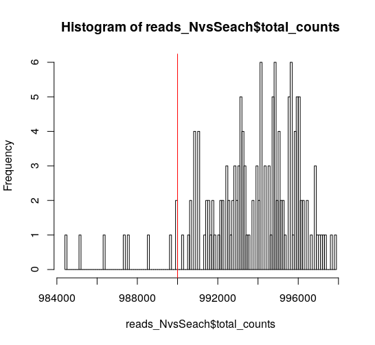

# 4. QC and normalization

## 4.0 Input datasets

load R libraries

```r
library(SingleCellExperiment)
library(scater)
options(stringsAsFactors = FALSE)
```

load the expression matrix and sample annotations

```r
mx <- read.table("GSE71008/GSE71008.NvsCRC.reads.txt", sep = "\t")
anno <- read.table("GSE71008/GSE71008.NvsCRC.anno.txt", sep = "\t", header=T)
```

Inspect a small portion of the expression matrix and sample annotations

```r
head(mx[,1:5])
```

```text
               s1S1 s1S2 s1S3 s2S1 s2S2
A-NT2RP7011570   11   10    6    0    9
C-ADG04260        1    1    1    1    1
C-ADG07684        2    3    5    3    5
C-ASTRO3000154    9    9   10    5   11
C-BRACE2001543    0    0    0    0    0
C-BRACE2001954    1    2    1    1    1
```

```r
head(anno)
```

```text
         CancerType Stage Individual Class
1 Colorectal_Cancer    1S       s1S1    S1
2 Colorectal_Cancer    1S       s1S2    S1
3 Colorectal_Cancer    1S       s1S3    S1
4 Colorectal_Cancer    1S       s1S4    S1
5 Colorectal_Cancer    1S       s1S5    S1
6 Colorectal_Cancer    1S       s1S9    S1
```

We create SCE object to standardize the analysis using both `SingleCellExperiment` \(SCE\) and `scater` packages.

```r
anno_NvsEachStage <- anno
mx_NvsEachStage <- mx
reads_NvsEachStage <- SingleCellExperiment(
    assays = list(counts = as.matrix(mx_NvsEachStage)),
    colData = anno_NvsEachStage)
```

Remove genes that are not expressed in any samples

```r
keep_feature <- rowSums(counts(reads_NvsEachStage) > 0) > 0
reads_NvsSeach <- reads_NvsEachStage[keep_feature, ]
```

Define control genes, usually should be ERCC spike-in. In our case, we use three most stably expressed RNA transcripts: miR-99a-5p, miR-30a-5p and miR-221-3p. See more details in [paper](https://www.nature.com/articles/srep19413).

```r
isSpike(reads_NvsEachStage, "stableRNA") <- rownames(reads_NvsEachStage) %in% 
    c("mature_miRNA:hsa-miR-99a-5p", "mature_miRNA:hsa-miR-30a-5p",
     "mature_miRNA:hsa-miR-221-3p")
```

## 4.1 Sample QC

Considering the heterogeneities and batch effect between samples, we need to filter out untreated samples and genes.

Calculate the quality metrics:

```text
reads_NvsEachStage <- calculateQCMetrics(
    reads_NvsEachStage,
    feature_controls = list(
        stableRNA = isSpike(reads_NvsEachStage, "stableRNA")
    )
)
```

### **library size**

```r
hist(reads_NvsEachStage$total_counts,breaks = 100)
abline(v=990000, col="red")
filter_by_total_counts <- (reads_NvsEachStage$total_counts > 990000)
table(filter_by_total_counts)
```



```text
filter_by_total_counts
FALSE  TRUE 
    9   141
```

### **detected genes**

```r
hist(reads_NvsEachStage$total_features,breaks = 100)
abline(v=2500, col="red")
filter_by_expr_features <- (reads_NvsEachStage$total_features > 2500)
table(filter_by_expr_features)
```


```text
filter_by_expr_features
FALSE  TRUE 
   10   140
```

### **Control genes**

Another measure of cell quality is the ratio between _spike-in_ /control RNAs and endogenous RNAs. This ratio can be used to estimate the total amount of RNA in the samples. Samples with a high level of _spike-in_ / control RNAs had low starting amounts of RNA, likely due to the RNA being degraded.

```text
plotPhenoData(
    reads_NvsEachStage,
    aes_string(
        x = "total_features",
        y = "pct_counts_stableRNA",
        colour = "Class"
    )
)
```


filter out samples with too high _spike-in_ / control RNA.

```r
filter_by_endoCtrl <- reads_NvsEachStage$pct_counts_stableRNA < 10
table(filter_by_endoCtrl)
```

### **Sample filtering **

Based on previous analysis, we can define a sample filter:

```r
reads_NvsEachStage$use <- (
    # sufficient features (genes)
    filter_by_expr_features &
    # sufficient molecules counted
    filter_by_total_counts &
    # sufficient endogenous RNA
    filter_by_endoCtrl
)
table(reads_NvsEachStage$use)
```

## 4.2 Gene QC

### gene expression

It is usually a good idea to exclude genes where we suspect that technical artefacts may have skewed the results. In our case, we consider the top 50 expressed genes.

```text
plotQC(reads_NvsEachStage, type = "highest-expression")
```


### **Gene filtering**

It is typically a good idea to remove genes whose expression level is considered **“undetectable”**. 

```r
filter_genes <- apply(
    counts(reads_NvsEachStage[, colData(reads_NvsEachStage)$use]), 
    1, 
    function(x) length(x[x >= 2]) >= 20
)
table(filter_genes)
rowData(reads_NvsEachStage)$use <- filter_genes
```

## 4.3 Save data

```r
dim(reads_NvsEachStage[rowData(reads_NvsEachStage)$use, colData(reads_NvsEachStage)$use])
saveRDS(reads_NvsEachStage, file = "GSE71008/GSE71008.reads_NvsEachStage.clean.rds")
```

## 4.4 identify confounding factors

There is a large number of potential confounders, artifacts and biases in sc-RNA-seq data. One of the main challenges in analyzing scRNA-seq data stems from the fact that it is difficult to carry out a true technical replicate \(why?\) to distinguish biological and technical variability. In the previous chapters we considered batch effects and in this chapter we will continue to explore how experimental artifacts can be identified and removed. We will continue using the `scater` package since it provides a set of methods specifically for quality control of experimental and explanatory variables. Moreover, we will continue to work with the Blischak data that was used in the previous chapter.


## Homework

### Software/Packages

### References

[Normalizing single-cell RNA sequencing data: challenges and opportunities, _Nature Methods_, 2017​](https://www.ncbi.nlm.nih.gov/pubmed/28504683)


