# 4. QC and normalization

## 4.0 Input datasets

load R libraries

```r
library(SingleCellExperiment)
library(scater)
options(stringsAsFactors = FALSE)
```

load the expression matrix and sample annotations

```r
mx <- read.table("GSE71008.NvsCRC.reads.txt", sep = "\t")
anno <- read.table("GSE71008.NvsCRC.anno.txt", sep = "\t", header=T)
# assign class
anno$Class <- "NC"
anno[which(anno$Stage=="1S"),]$Class <- "S1"
anno[which(anno$Stage=="2S"),]$Class <- "S2"
anno[which(anno$Stage=="3S"),]$Class <- "S3"
anno[which(anno$Stage=="4S"),]$Class <- "S4"
```

Inspect a small portion of the expression matrix and sample annotations

```r
head(mx[,1:5])
```

```text
               s1S1 s1S2 s1S3 s2S1 s2S2
A-NT2RP7011570   11   10    6    0    9
C-ADG04260        1    1    1    1    1
C-ADG07684        2    3    5    3    5
C-ASTRO3000154    9    9   10    5   11
C-BRACE2001543    0    0    0    0    0
C-BRACE2001954    1    2    1    1    1
```

```r
head(anno)
```

```text
         CancerType Stage Individual Class
1 Colorectal_Cancer    1S       s1S1    S1
2 Colorectal_Cancer    1S       s1S2    S1
3 Colorectal_Cancer    1S       s1S3    S1
4 Colorectal_Cancer    1S       s1S4    S1
5 Colorectal_Cancer    1S       s1S5    S1
6 Colorectal_Cancer    1S       s1S9    S1
```

We create SCE object to standardize the analysis using both `SingleCellExperiment` \(SCE\) and `scater` packages.

```r
anno_NvsEachStage <- anno
mx_NvsEachStage <- mx
reads_NvsEachStage <- SingleCellExperiment(
    assays = list(counts = as.matrix(mx_NvsEachStage)),
    colData = anno_NvsEachStage)
```

Remove genes that are not expressed in any samples

```r
keep_feature <- rowSums(counts(reads_NvsEachStage) > 0) > 0
reads_NvsSeach <- reads_NvsEachStage[keep_feature, ]
```

Define control genes, usually should be ERCC spike-in. In our case, we use three most stably expressed RNA transcripts: miR-99a-5p, miR-30a-5p and miR-221-3p. See more details in [paper](https://www.nature.com/articles/srep19413).

```r
isSpike(reads_NvsEachStage, "stableRNA") <- rownames(reads_NvsEachStage) %in% 
    c("mature_miRNA:hsa-miR-99a-5p", "mature_miRNA:hsa-miR-30a-5p",
     "mature_miRNA:hsa-miR-221-3p")
```

## 4.1 Sample QC

Considering the heterogeneities and batch effect between samples, we need to filter out untreated samples and genes.

Calculate the quality metrics:

```text
reads_NvsEachStage <- calculateQCMetrics(
    reads_NvsEachStage,
    feature_controls = list(
        stableRNA = isSpike(reads_NvsEachStage, "stableRNA")
    )
)
```

### **library size**

```r
hist(reads_NvsEachStage$total_counts,breaks = 100)
abline(v=990000, col="red")
filter_by_total_counts <- (reads_NvsEachStage$total_counts > 990000)
table(filter_by_total_counts)
```


```text
filter_by_total_counts
FALSE  TRUE 
    9   141
```

### **detected genes**

```r
hist(reads_NvsEachStage$total_features,breaks = 100)
abline(v=2500, col="red")
filter_by_expr_features <- (reads_NvsEachStage$total_features > 2500)
table(filter_by_expr_features)
```


```text
filter_by_expr_features
FALSE  TRUE 
   10   140
```

### **Control genes**

Another measure of cell quality is the ratio between _spike-in_ /control RNAs and endogenous RNAs. This ratio can be used to estimate the total amount of RNA in the samples. Samples with a high level of _spike-in_ / control RNAs had low starting amounts of RNA, likely due to the RNA being degraded.

```text
plotPhenoData(
    reads_NvsEachStage,
    aes_string(
        x = "total_features",
        y = "pct_counts_stableRNA",
        colour = "Class"
    )
)
```

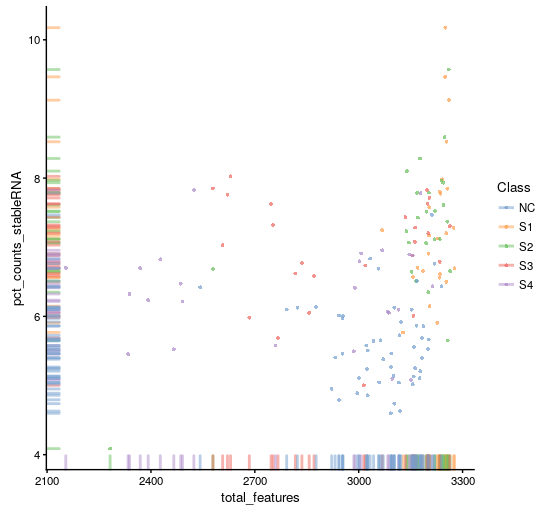

filter out samples with too high _spike-in_ / control RNA.

```r
filter_by_endoCtrl <- reads_NvsEachStage$pct_counts_stableRNA < 10
table(filter_by_endoCtrl)
```

### **Sample filtering** 

Based on previous analysis, we can define a sample filter:

```r
reads_NvsEachStage$use <- (
    # sufficient features (genes)
    filter_by_expr_features &
    # sufficient molecules counted
    filter_by_total_counts &
    # sufficient endogenous RNA
    filter_by_endoCtrl
)
table(reads_NvsEachStage$use)
```

## 4.2 Gene QC

### gene expression

It is usually a good idea to exclude genes where we suspect that technical artefacts may have skewed the results. In our case, we consider the top 50 expressed genes.

```text
plotQC(reads_NvsEachStage, type = "highest-expression")
```


### **Gene filtering**

It is typically a good idea to remove genes whose expression level is considered **“undetectable”**. 

```r
filter_genes <- apply(
    counts(reads_NvsEachStage[, colData(reads_NvsEachStage)$use]), 
    1, 
    function(x) length(x[x >= 2]) >= 20
)
table(filter_genes)
rowData(reads_NvsEachStage)$use <- filter_genes
```

## 4.3 Save data

```r
dim(reads_NvsEachStage[rowData(reads_NvsEachStage)$use, colData(reads_NvsEachStage)$use])
saveRDS(reads_NvsEachStage, file = "GSE71008.reads_NvsEachStage.clean.rds")
```

## 4.4 Visualization

### The PCA plot

The easiest way to overview the data is by transforming it using the principal component analysis and then visualize the first two principal components.

First, we compare the PCA results before and after QC.

**Before QC**

```r
endog_genes <- !rowData(reads_NvsEachStage)$is_feature_control
plotPCA(
    reads_NvsEachStage[endog_genes, ],
    exprs_values = "counts",
    colour_by = "Class",
    size_by = "total_features"
)
```

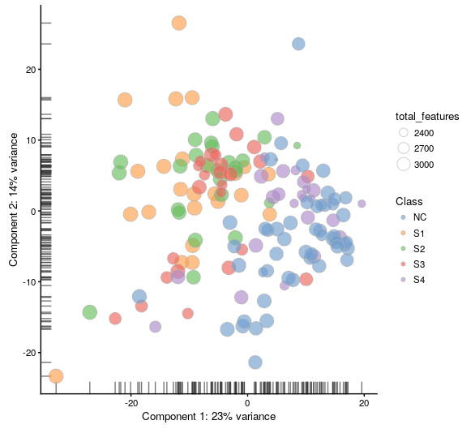

**After QC**

```r
reads_NvsEachStage.qc <- reads_NvsEachStage[rowData(reads_NvsEachStage)$use, colData(reads_NvsEachStage)$use]
endog_genes <- !rowData(reads_NvsEachStage.qc)$is_feature_control
plotPCA(
    reads_NvsEachStage.qc[endog_genes, ],
    exprs_values = "counts",
    colour_by = "Class",
    size_by = "total_features"
)
```

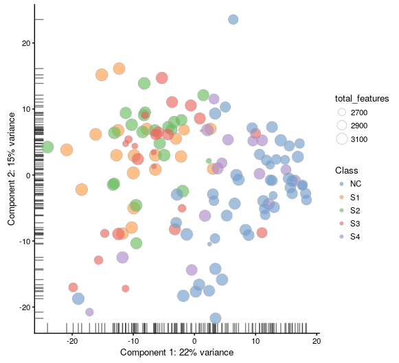

By default only the top 500 most variable genes are used by scater to calculate the PCA. This can be adjusted by changing the `ntop` argument.

use top 100 genes

```r
plotPCA(
    reads_NvsEachStage.qc[endog_genes, ],
    exprs_values = "counts",
    colour_by = "Class",
    size_by = "total_features",
    ntop = 100
)
```


### The tSNE map

 tSNE \(t-Distributed Stochastic Neighbor Embedding\) combines dimensionality reduction \(e.g. PCA\) with random walks on the nearest-neighbour network to map high dimensional data to a 2-dimensional space while preserving local distances between samples. In contrast with PCA, tSNE is a stochastic algorithm which means running the method multiple times on the same dataset will result in different plots. Due to the non-linear and stochastic nature of the algorithm, tSNE is more difficult to intuitively interpret tSNE. To ensure reproducibility, we fix the “seed” of the random-number generator in the code below so that we always get the same plot.

Before QC

```r
plotTSNE(
    reads_NvsEachStage[endog_genes, ],
    exprs_values = "counts",
    perplexity = 40,
    colour_by = "Class",
    size_by = "total_features",
    rand_seed = 123456,
    ntop = 100
)
```

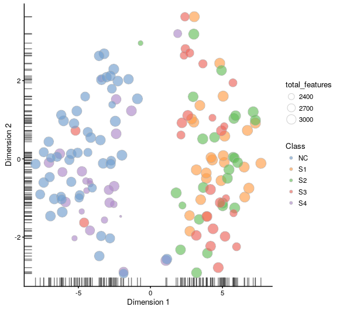

After QC

```r
plotTSNE(
    reads_NvsEachStage.qc[endog_genes, ],
    exprs_values = "counts",
    perplexity = 40,
    colour_by = "Class",
    size_by = "total_features",
    rand_seed = 123456,
    ntop = 100
)
```


Furthermore, tSNE requires you to provide a value of `perplexity` which reflects the number of neighbours used to build the nearest-neighbour network; a high value creates a dense network which clumps samples together while a low value makes the network more sparse allowing groups of samples to separate from each other. `scater` uses a default perplexity of the total number of cells divided by five \(rounded down\).

set perplexity = 10

```r
plotTSNE(
    reads_NvsEachStage.qc[endog_genes, ],
    exprs_values = "counts",
    perplexity = 10,
    colour_by = "Class",
    size_by = "total_features",
    rand_seed = 123456,
    ntop = 100
)
```


## 4.5 Normalization

### Systematic biases


### Size factor & global-scale normalization

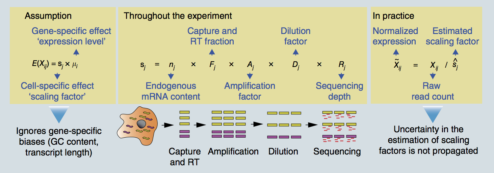

please reference this paper:

[Normalizing single-cell RNA sequencing data: challenges and opportunities, _Nature Methods_, 2017​](https://www.ncbi.nlm.nih.gov/pubmed/28504683)


`scater`allows us to normalize raw counts using function `normaliseExprs()`

To compare the efficiency of different normalization methods we will use visual inspection of `PCA` plots and calculation of cell-wise _relative log expression_ via `scater`’s `plotRLE()` function. Namely, cells with many \(few\) reads have higher \(lower\) than median expression for most genes resulting in a positive \(negative\) _RLE_ across the cell, whereas normalized cells have an _RLE_ close to zero. Example of a _RLE_ function in `R`:

```r
calc_sample_RLE <-
function (expr_mat, spikes = NULL) 
{
    RLE_gene <- function(x) {
        if (median(unlist(x)) > 0) {
            log((x + 1)/(median(unlist(x)) + 1))/log(2)
        }
        else {
            rep(NA, times = length(x))
        }
    }
    if (!is.null(spikes)) {
        RLE_matrix <- t(apply(expr_mat[-spikes, ], 1, RLE_gene))
    }
    else {
        RLE_matrix <- t(apply(expr_mat, 1, RLE_gene))
    }
    sample_RLE <- apply(RLE_matrix, 2, median, na.rm = T)
    return(sample_RLE)
}
```

First, we filter out cleaned dataset

```r
reads_NvsEachStage.qc <- reads_NvsEachStage[rowData(reads_NvsEachStage)$use, colData(reads_NvsEachStage)$use]
```

### CPM

The simplest way to normalize this data is to convert it to counts per million \(**CPM**\) by dividing each column by its total then multiplying by 1,000,000.

```text
logcounts(reads_NvsEachStage.qc) <- log2(calculateCPM(reads_NvsEachStage.qc, use.size.factors = FALSE) + 1)
plotPCA(
    reads_NvsEachStage.qc[endog_genes, ],
    exprs_values = "logcounts",
    colour_by = "Class",
    size_by = "total_features"
)
plotRLE(
    reads_NvsEachStage.qc[endog_genes, ],
    exprs_mats = list(Raw = "counts", CPM = "logcounts"),
    exprs_logged = c(TRUE, TRUE),
    colour_by = "Class"
)
```


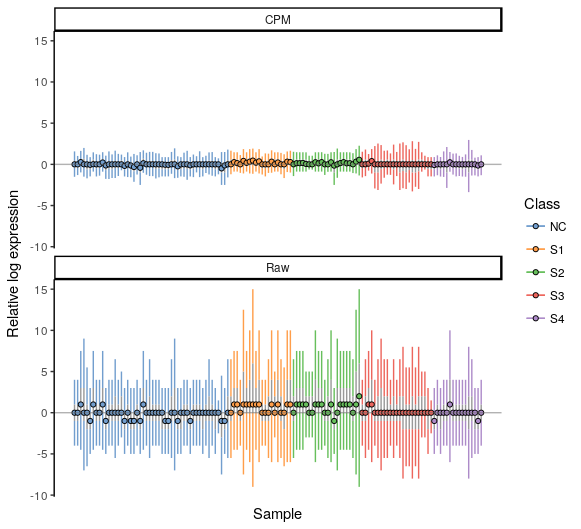

### TMM \(edgeR\)

Another method is called **TMM** is the weighted trimmed mean of M-values \(to the reference\) proposed by edgeR. The M-values in question are the gene-wise log2 fold changes between individual samples.

```text
reads_NvsEachStage.qc <- normaliseExprs(
    reads_NvsEachStage.qc,
    method = "TMM",
    feature_set = endog_genes,
    return_log = TRUE,
    return_norm_as_exprs = TRUE
)

plotPCA(
    reads_NvsEachStage.qc[endog_genes, ],
    exprs_values = "normcounts",
    colour_by = "Class",
    size_by = "total_features"
)

plotRLE(
    reads_NvsEachStage.qc[endog_genes, ],
    exprs_mats = list(Raw = "counts", TMM = "normcounts"),
    exprs_logged = c(TRUE, TRUE),
    colour_by = "Class"
)
```

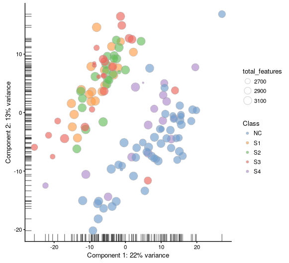

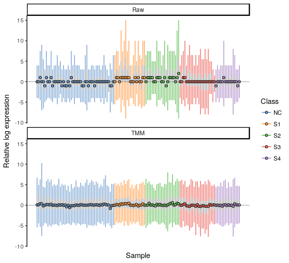

### SF \(DESeq2\)

The **size factor \(SF\)** was proposed and popularized by DESeq. First the geometric mean of each gene across all cells is calculated.

```text
reads_NvsEachStage.qc <- normaliseExprs(
    reads_NvsEachStage.qc,
    method = "RLE",
    feature_set = endog_genes,
    return_log = TRUE,
    return_norm_as_exprs = TRUE,
    exprs_values = exprs
)
plotPCA(
    reads_NvsEachStage.qc[endog_genes, ],
    exprs_values = "normcounts",
    colour_by = "Class",
    size_by = "total_features"
)
plotRLE(
    reads_NvsEachStage.qc[endog_genes, ],
    exprs_mats = list(Raw = "counts", SF = "normcounts"),
    exprs_logged = c(TRUE, TRUE),
    colour_by = "Class"
)
```

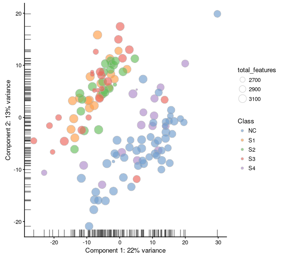


### scran

`scran` package implements a variant on **CPM** specialized for single-cell data. Briefly this method deals with the problem of vary large numbers of zero values per cell by pooling cells together calculating a normalization factor \(similar to **CPM**\) for the sum of each pool. Since each cell is found in many different pools, cell-specific factors can be deconvoluted from the collection of pool-specific factors using linear algebra.

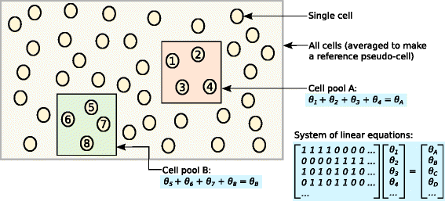

please reference this paper: [Pooling Across Cells to Normalize Single-Cell RNA Sequencing Data with Many Zero Counts. _Genome Biol_ 17 \(1\). Springer Nature. ](https://genomebiology.biomedcentral.com/articles/10.1186/s13059-016-0947-7)

```text
library(scran)
# define cluster for each sample
sampleLables <- c()
for(i in colnames(reads_NvsEachStage.qc)){tmp <- as.character(anno[which(anno$Individual==i),"Class"]); sampleLables <- c(sampleLables,tmp)}
sampleLables <- replace(sampleLables, which(sampleLables=="S1"),1)
sampleLables <- replace(sampleLables, which(sampleLables=="S2"),2)
sampleLables <- replace(sampleLables, which(sampleLables=="S3"),3)
sampleLables <- replace(sampleLables, which(sampleLables=="S4"),4)
sampleLables <- replace(sampleLables, which(sampleLables=="NC"),5)
sampleLables <- as.numeric(sampleLables)

reads_NvsEachStage.qc <- computeSumFactors(
    reads_NvsEachStage.qc,
    sizes = 10, 
    clusters = sampleLables
)
reads_NvsEachStage.qc <- normalize(reads_NvsEachStage.qc)

plotPCA(
    reads_NvsEachStage.qc, 
    exprs_values = "logcounts", 
    colour_by = "Class", 
    size_by = "total_features"
)
plotTSNE(
    reads_NvsEachStage.qc, 
    exprs_values = "logcounts", 
    perplexity = 10, 
    colour_by = "Class", 
    size_by = "total_features", 
    rand_seed = 123456
)
plotRLE(
    reads_NvsEachStage.qc, 
    exprs_mats = list(Raw = "counts", scran = "logcounts"), 
    exprs_logged = c(TRUE, TRUE), 
    colour_by = "Class"
)
```

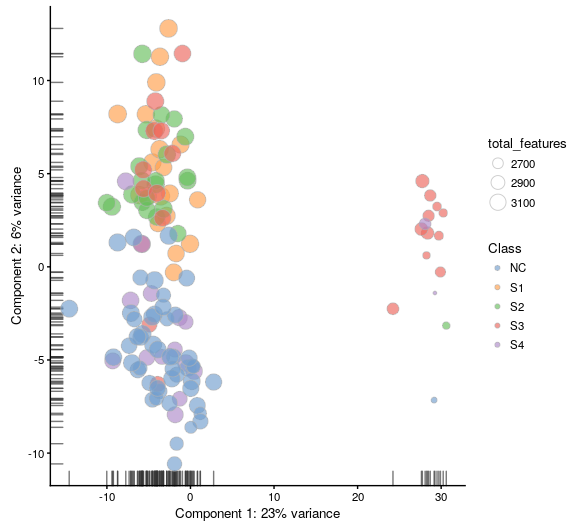

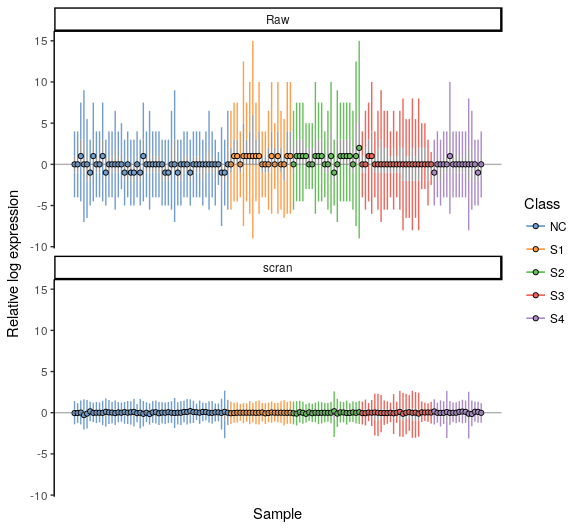

## Optional: rank-based methods


[X Li, et al. A rank-based algorithm of differential expression analysis for small cell line data with statistical control. Briefings in Bioinformatics, 2017, 1–10](https://academic.oup.com/bib/advance-article/doi/10.1093/bib/bbx135/4524052) 

## Scripts and Code

[https://github.com/lulab/training/tree/master/proj\_exRNA/example\_small/advanceAnalysis](https://github.com/lulab/training/tree/master/proj_exRNA/example_small/advanceAnalysis)

## Software/Packages

R: [SingleCellExperiment](https://bioconductor.org/packages/release/bioc/html/SingleCellExperiment.html)

Defines a S4 class for storing data from single-cell experiments. This includes specialized methods to store and retrieve spike-in information, dimensionality reduction coordinates and size factors for each cell, along with the usual metadata for genes and libraries.

R: [scater](https://bioconductor.org/packages/release/bioc/html/scater.html)

A collection of tools for doing various analyses of single-cell RNA-seq gene expression data, with a focus on quality control.

R: [scran](https://bioconductor.org/packages/release/bioc/html/scran.html)

Implements functions for low-level analyses of single-cell RNA-seq data. Methods are provided for normalization of cell-specific biases, assignment of cell cycle phase, detection of highly variable and significantly correlated genes, correction of batch effects, identification of marker genes, and other common tasks in single-cell analysis workflows.

## References

[Normalizing single-cell RNA sequencing data: challenges and opportunities, _Nature Methods_, 2017​](https://www.ncbi.nlm.nih.gov/pubmed/28504683)

[A rank-based algorithm of differential expression analysis for small cell line data with statistical control. Briefings in Bioinformatics, 2017, 1–10](https://academic.oup.com/bib/advance-article/doi/10.1093/bib/bbx135/4524052) 

[Pooling Across Cells to Normalize Single-Cell RNA Sequencing Data with Many Zero Counts. _Genome Biol_ 17 \(1\). Springer Nature. ](https://genomebiology.biomedcentral.com/articles/10.1186/s13059-016-0947-7)

## 


