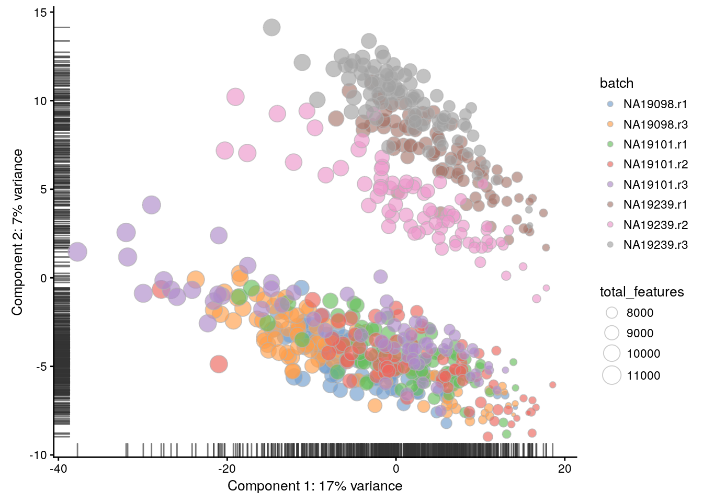
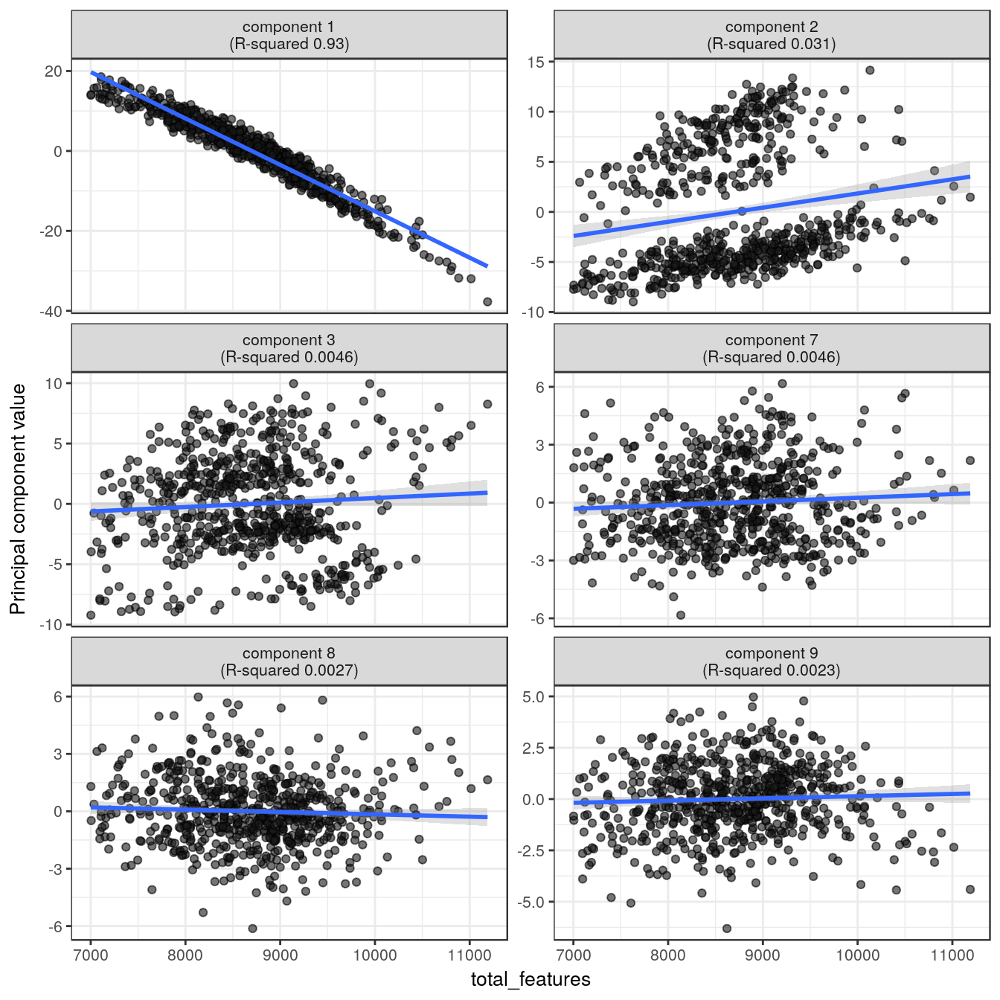
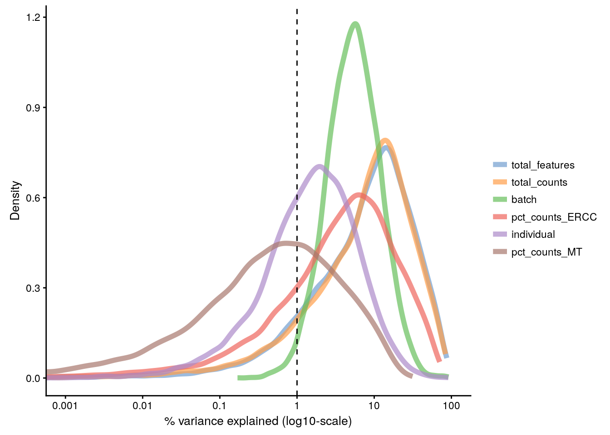

# 5. Imputation and confounders

## 5.1 Imputation

One of the main challenges when analyzing scRNA-seq data is the presence of zeros, or dropouts. The dropouts are assumed to have arisen for three possible reasons:

* The gene was not expressed in the sample and hence there are no transcripts to sequence
* The gene was expressed, but for some reason the transcripts were lost somewhere prior to sequencing
* The gene was expressed and transcripts were captured and turned into cDNA, but the sequencing depth was not sufficient to produce any reads.

first, we attached the R library and load the expression matrix after QC \(saved in last chapter\).

```r
library(SingleCellExperiment)
library(scater)
options(stringsAsFactors = FALSE)
setwd("./GSE71008")

reads_NvsEachStage.qc <- readRDS("GSE71008.reads_NvsEachStage.clean.batch.rds")
anno <- read.table("GSE71008.NvsCRC.annoWithBatch.txt", sep = "\t", header=T)
```

To use R package `scImpute`, we use the default parameters and takes a .csv or .txt file as an input:

```text
write.csv(counts(reads_NvsEachStage.qc), "GSE71008.reads_NvsEachStage.qc.rds.csv")
```

```r
 scimpute(
    count_path = "GSE71008.reads_NvsEachStage.qc.rds.csv", 
    infile = "csv", 
    outfile = "txt", 
    out_dir = "./", 
    Kcluster =5, 
    ncores = 2,  
    labeled = TRUE)

res.qc <- read.table("scimpute_count.txt")
reads_NvsEachStage.qc.impute <- SingleCellExperiment(assays = list(counts = as.matrix(res.qc)), colData = colData(reads_NvsEachStage.qc))
reads_NvsEachStage.qc.impute <- calculateQCMetrics(reads_NvsEachStage.qc.impute)
assay(reads_NvsEachStage.qc.impute, "logcounts_raw") <- log2(counts(reads_NvsEachStage.qc.impute) + 1) 
```

compare the difference before and after imputation

**raw data**


## 5.2 identify confounding factors

There is a large number of potential confounders, artifacts and biases in sc-RNA-seq data. One of the main challenges in analyzing scRNA-seq data stems from the fact that it is difficult to carry out a true technical replicate \(why?\) to distinguish biological and technical variability. In the previous chapters we considered batch effects and in this chapter we will continue to explore how experimental artifacts can be identified and removed. We will continue using the `scater` package since it provides a set of methods specifically for quality control of experimental and explanatory variables. Moreover, we will continue to work with the Blischak data that was used in the previous chapter.

```text
library(scater, quietly = TRUE)
options(stringsAsFactors = FALSE)
umi <- readRDS("tung/umi.rds")
umi.qc <- umi[rowData(umi)$use, colData(umi)$use]
endog_genes <- !rowData(umi.qc)$is_feature_control
```

The `umi.qc` dataset contains filtered cells and genes. Our next step is to explore technical drivers of variability in the data to inform data normalisation before downstream analysis.

#### Correlations with PCs

Let’s first look again at the PCA plot of the QCed dataset:

```text
plotPCA(
    umi.qc[endog_genes, ],
    exprs_values = "logcounts_raw",
    colour_by = "batch",
    size_by = "total_features"
)
```



`scater` allows one to identify principal components that correlate with experimental and QC variables of interest \(it ranks principle components by R^2 from a linear model regressing PC value against the variable of interest\).

Let’s test whether some of the variables correlate with any of the PCs.

**Detected genes**

```text
plotQC(
    umi.qc[endog_genes, ],
    type = "find-pcs",
    exprs_values = "logcounts_raw",
    variable = "total_features"
)
```



Indeed, we can see that `PC1` can be almost completely explained by the number of detected genes. In fact, it was also visible on the PCA plot above. This is a well-known issue in scRNA-seq and was described [here](http://biorxiv.org/content/early/2015/12/27/025528).

**Explanatory variables**

`scater` can also compute the marginal R2R2 for each variable when fitting a linear model regressing expression values for each gene against just that variable, and display a density plot of the gene-wise marginal R2R2 values for the variables.

```text
plotQC(
    umi.qc[endog_genes, ],
    type = "expl",
    exprs_values = "logcounts_raw",
    variables = c(
        "total_features",
        "total_counts",
        "batch",
        "individual",
        "pct_counts_ERCC",
        "pct_counts_MT"
    )
)
```



